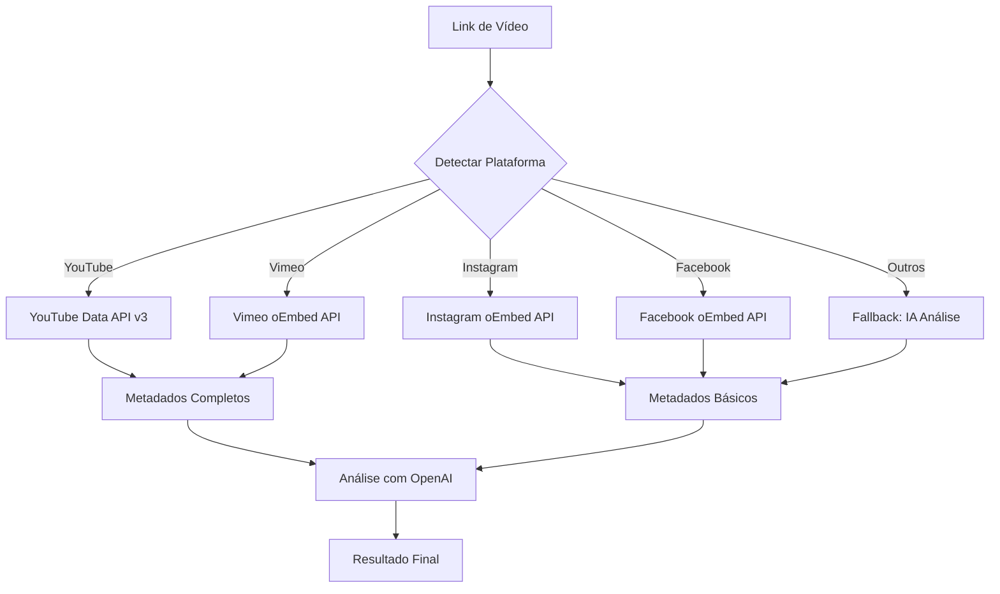

# 📱 Suporte a Plataformas de Vídeo

## Resumo Rápido

| Plataforma | Status | API Usada | Precisa Auth? | Descrição | Thumbnail | URL |
|------------|--------|-----------|---------------|-----------|-----------|-----|
| **YouTube** | ✅ Completo | YouTube Data API v3 | ❌ Só API Key | ✅ Completa | ✅ Alta qualidade | ✅ |
| **Instagram** | ✅ Funcional | oEmbed API | ❌ Pública | ⚠️ Limitada | ✅ Sim | ✅ |
| **Facebook** | ✅ Funcional | oEmbed API | ❌ Pública | ⚠️ Limitada | ✅ Sim | ✅ |
| **Vimeo** | ✅ Completo | oEmbed API | ❌ Pública | ✅ Boa | ✅ Alta qualidade | ✅ |
| **TikTok** | ⚠️ Detecta | N/A | N/A | ❌ Não | ❌ Não | ❌ |

---

## 🎥 YouTube

### ✅ O que funciona:
- Título completo do vídeo
- Descrição completa (até 5000 caracteres)
- Thumbnail em múltiplas resoluções (default, medium, high, maxres)
- Duração do vídeo
- Nome do canal
- Tags do vídeo
- Estatísticas (views, likes, comentários)
- Data de publicação
- Categoria

### 🔧 Implementação:
```typescript
// API oficial do Google
const apiUrl = `https://www.googleapis.com/youtube/v3/videos`;
// Requer: GOOGLE_API_KEY no .env
```

### 📋 Requisitos:
- `GOOGLE_API_KEY` configurada
- Vídeo precisa ser público

---

## 📸 Instagram

### ✅ O que funciona:
- Título do post (se disponível)
- Nome do autor
- URL do perfil do autor
- Thumbnail do vídeo/imagem
- Dimensões (largura x altura)

### ⚠️ Limitações:
- Descrição/caption completa NÃO está disponível via oEmbed
- Não retorna likes, comentários ou views
- Não retorna tags/hashtags
- Só funciona para posts **públicos**
- Posts privados retornarão erro

### 🔧 Implementação:
```typescript
// oEmbed público - SEM autenticação
const oembedUrl = `https://api.instagram.com/oembed/?url=${videoUrl}`;
```

### 📋 Requisitos:
- ❌ Nenhum! API pública sem autenticação
- Post precisa ser público

### 💡 Exemplo de Resposta:
```json
{
  "title": "Post do Instagram",
  "author": "@usuario",
  "thumbnail_url": "https://...",
  "thumbnail_width": 640,
  "thumbnail_height": 640
}
```

---

## 📘 Facebook

### ✅ O que funciona:
- Título do vídeo
- Nome do autor/página
- URL do autor/página
- Thumbnail do vídeo
- Dimensões do vídeo

### ⚠️ Limitações:
- Descrição completa NÃO está disponível via oEmbed
- Não retorna likes, comentários ou shares
- Só funciona para vídeos **públicos**
- Vídeos privados/restritos retornarão erro

### 🔧 Implementação:
```typescript
// oEmbed público - SEM autenticação
const oembedUrl = `https://www.facebook.com/plugins/video/oembed.json/?url=${videoUrl}`;
```

### 📋 Requisitos:
- ❌ Nenhum! API pública sem autenticação
- Vídeo precisa ser público

### 💡 Exemplo de Resposta:
```json
{
  "title": "Vídeo do Facebook",
  "author_name": "Nome da Página",
  "thumbnail_url": "https://...",
  "width": 1280,
  "height": 720
}
```

---

## 🎥 Vimeo

### ✅ O que funciona:
- Título completo do vídeo
- Descrição do vídeo
- Nome do autor
- URL do perfil do autor
- Thumbnail em alta qualidade
- Duração do vídeo
- Dimensões do vídeo

### 🔧 Implementação:
```typescript
// oEmbed público - SEM autenticação
const oembedUrl = `https://vimeo.com/api/oembed.json?url=${videoUrl}`;
```

### 📋 Requisitos:
- ❌ Nenhum! API pública sem autenticação
- Vídeo precisa ser público

### 💡 Exemplo de Resposta:
```json
{
  "title": "Título do Vídeo",
  "description": "Descrição completa",
  "author_name": "Nome do Criador",
  "thumbnail_url": "https://...",
  "duration": 180,
  "width": 1920,
  "height": 1080
}
```

---

## 🎵 TikTok

### ⚠️ Status: Apenas Detecção
- Sistema detecta que é um link do TikTok
- Mas NÃO extrai metadados

### ❌ Por quê?
- TikTok não tem oEmbed público
- API oficial requer autenticação OAuth complexa
- Scraping é contra os termos de serviço

### 🔮 Futuro:
- Possível implementar com TikTok API oficial
- Requereria registro de app e processo de aprovação

---

## 🔄 Fluxo de Processamento



---

## 🎯 Recomendações de Uso

### Para Melhor Qualidade:
1. **YouTube**: Funciona perfeitamente, use sem preocupação
2. **Vimeo**: Ótima qualidade de metadados, recomendado
3. **Instagram/Facebook**: Funcional mas limitado, OK para uso básico

### Limitações Conhecidas:
- Instagram e Facebook não retornam descrição completa
- Use a IA (OpenAI) para complementar informações faltantes
- Posts/vídeos privados não funcionam em nenhuma plataforma

---

## 🛠️ Troubleshooting

### Instagram não funciona?
- ✅ Verifique se o post é público
- ✅ Teste o link no navegador sem estar logado
- ✅ Links de Stories não funcionam (expiram em 24h)

### Facebook não funciona?
- ✅ Verifique se o vídeo é público
- ✅ Use links do formato `facebook.com/watch/?v=` ou `fb.watch/`
- ✅ Vídeos de grupos privados não funcionam

### YouTube não funciona?
- ✅ Verifique se `GOOGLE_API_KEY` está configurada
- ✅ Verifique se o vídeo é público (não privado/não listado)
- ✅ Verifique a quota da API no Google Cloud Console

### Vimeo não funciona?
- ✅ Verifique se o vídeo é público
- ✅ Vídeos com senha não funcionam via oEmbed

---

## 📊 Comparação: oEmbed vs API Oficial

### oEmbed (Instagram, Facebook, Vimeo)
**Vantagens:**
- ✅ Sem autenticação necessária
- ✅ Simples de implementar
- ✅ Não tem limites de quota
- ✅ Não precisa registro de app

**Desvantagens:**
- ❌ Metadados limitados
- ❌ Sem estatísticas (likes, views)
- ❌ Sem descrição completa (IG/FB)

### API Oficial (YouTube)
**Vantagens:**
- ✅ Metadados completos
- ✅ Estatísticas detalhadas
- ✅ Descrição completa
- ✅ Tags e categorias

**Desvantagens:**
- ❌ Requer API Key
- ❌ Tem limite de quota (10.000/dia)
- ❌ Precisa configuração no Google Cloud

---

## 🚀 Próximos Passos (Possíveis Melhorias)

1. **TikTok API**: Implementar quando houver necessidade
2. **Twitter/X Videos**: Adicionar suporte via oEmbed
3. **Twitch**: Adicionar suporte via API oficial
4. **Cache**: Implementar cache de metadados para economizar chamadas
5. **Webhook**: Notificar quando processamento completar

